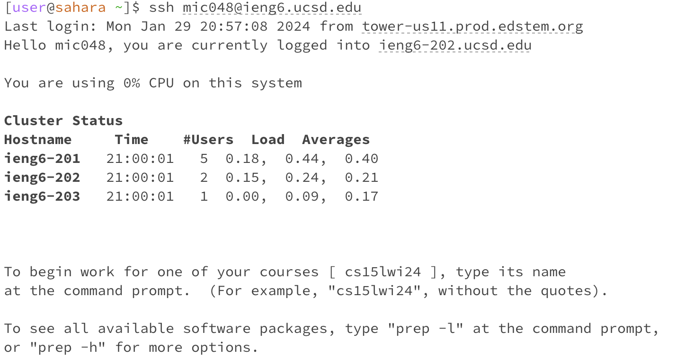

# Lab Report 2  
In this week's lab, we started our own servers!

## ChatServer Code

## Screenshot 1

- When we add the query `/add-message?s=Hello&user=jpolitz` to our url, the handleRequest method is called.
- The `handleRequest` method takes in the url as an argument. Additionally, our `ChatServer` class has a field `String x` that is updated each time a message is added successfully.
- The field `String x` was changed since the message "jpolitz: Hello" was added to it. Also, the `URI url` argument was also updated to add the query `/add-message?s=Hello&user=jpolitz`.

## Screenshot 2

- When we add the query `/add-message?s=hi there&user=mia` to our url, the handleRequest method is called.
- Similar to the first screenshot, the `handleRequest` method takes in the url as an argument. Additionally, our `ChatServer` class has a field `String x` that is updated each time a message is added successfully.
- The field `String x` was changed since the message "mia: hi there" was added to it. It now consists of the two messages with a `"\n"` in front.  Also, the `URI url` argument was also updated to add the query `/add-message?s=hi there&user=mia`.

## SSH

- The private key is the one without the `.pub` ending, which would be `/home/.ssh/id_ed25519`.
- The path to the public key locally is `/home/.ssh/id_ed25519.pub`.

- The path to the public key remotely is `/home/linux/ieng6/oce/9f/mic048/.ssh/authorized_keys`.

- This is my terminal reaction that didn't require me to log in!

## Reflections
In these two weeks, I learned about how to run commands on another computer using the `ssh` command. We are able to use ssh to run programs on a remote shell in the `ieng6` servers. We also learned how to create a private/public key pair in order to log into the computers without our passwords!

