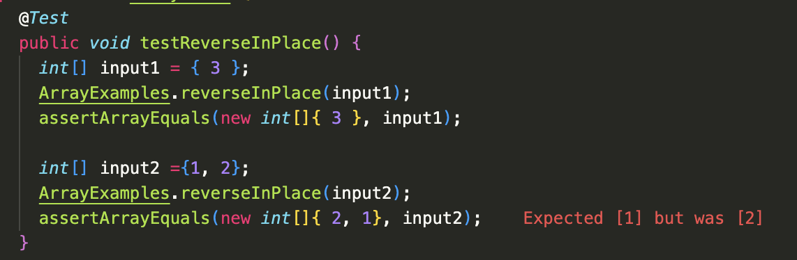

# Lab Report 3 <br/>
In this week's lab, we debugged and used more commands!

## Part 1 <br/>
## A failure-inducing input for the buggy program, as a JUnit test and any associated code.
```
@Test 
	public void testReverseInPlace() {
    int[] input2 ={1, 2};
    ArrayExamples.reverseInPlace(input2);
    assertArrayEquals(new int[]{2, 1}, input2);
	}
```
The test expected `{2, 1}` as the output but instead got `{2, 1}`. 

## An input that doesn't induce a failure, as a JUnit test and any associated code

```
@Test 
	public void testReverseInPlace() {
    int[] input1 = { 3 };
    ArrayExamples.reverseInPlace(input1);
    assertArrayEquals(new int[]{ 3 }, input1);
	}
```
## The symptom, as the output of running the tests (provide it as a screenshot of running JUnit with at least the two inputs above)

## The bug, as the before-and-after code change required to fix it (as two code blocks in Markdown)
Before: 
```
static void reverseInPlace(int[] arr) {
    for(int i = 0; i < arr.length; i += 1) {
      arr[i] = arr[arr.length - i - 1];
    }
}
```
After:
```
static void reverseInPlace(int[] arr) {
    int[] newArray = new int[arr.length];
    for(int i = 0; i < arr.length; i += 1) {
      newArray[i] = arr[arr.length - i - 1];
    }
    for (int i = 0; i < newArray.length; i++){
      arr[i] = newArray[i];
    }
}
```
Before, there was only one array which posed a problem. For instance, when we are trying to update the last element to the original first element, the original first element has already been updated to the last element. In the fixed code, there is a new array where we can leave the input array as is when reversing it. Then we copy all the elements from the new array to the input array to get the desired result. 

## Reflections
In these two weeks, I learned about how to run commands on another computer using the `ssh` command. We are able to use ssh to run programs on a remote shell in the `ieng6` servers. We also learned how to create a private/public key pair in order to log into the computers without our passwords!

