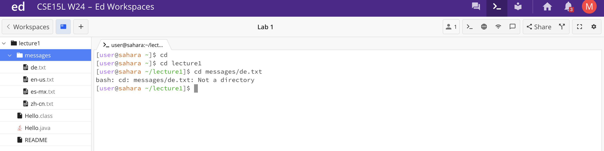
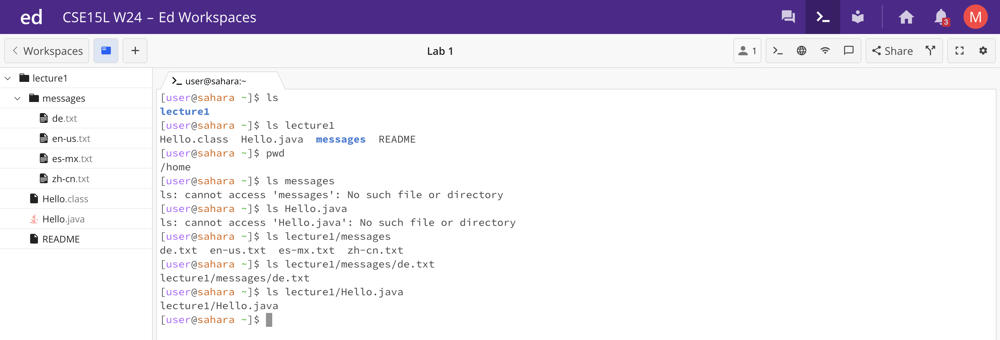
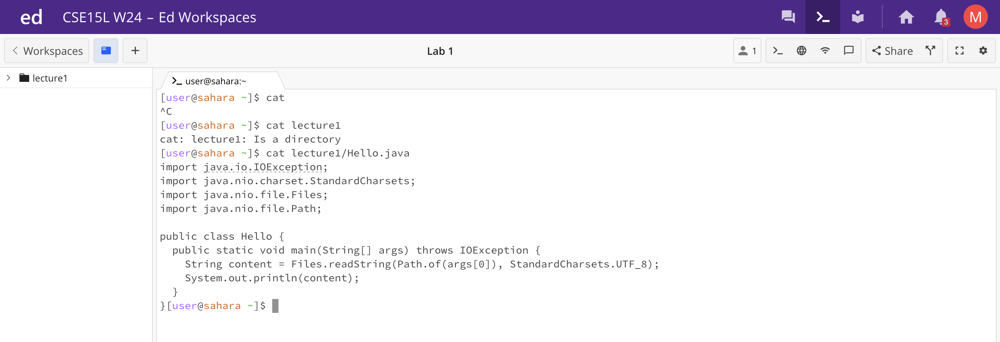

# Lab 1 Report  
In this week's lecture, we learned about basic filesystem commands.

## `cd` command

With no arguments:
- The working directory is `/home`, which can be verified by typing `pwd` into the command line.
- When you enter `cd` without any arguments, there will be no output because we are not telling the computer to change the directory.
- There is no error.
 

With a directory as an argument:
- The working directory is `/home`, which can be verified by typing `pwd` into the command line. After the command is run, the directory changes to `/lecture1`.
- There is no output because the `cd` command does not print anything when successful. However, if you look carefully, you will see that there is now a `~lecture1` added to the end of `user@sahara` telling us our current directory is now `/lecture1`.
- There is no error.
 
  
With a file as an argument:
- The working directory is `/lecture1`, since it was changed to `/lecture1` in the previous step.
- The system outputs an error saying that `de.txt` is not a directory.
- `cd` only takes directories as arguments because it is trying to change directories. It cannot receive a file as an argument.
 

## `ls` command

With no arguments:
- The working directory is `/home`, which can be verified by typing `pwd` into the command line.
- When you enter `ls` without any arguments, the directories in `/home`, our current working directory, will be printed. In this case, `lecture1`.
- There is no error.
 

With a directory as an argument:
- The working directory is `/home`, which can be verified by typing `pwd` into the command line.
- All of the directories and files under `/lecture1`, which was my argument, are printed: Hello.class, Hello.java, messages, and README. 
- There is no error.
 

With a file as an argument:
- The working directory is still `/home`, since I haven't changed it.
- The system prints out the path to the file I put in as an argument.
- There is no error. ?????
 

## `cat` command

With no arguments:
- The working directory is `/home`, which can be verified by typing `pwd` into the command line.
- When you enter `cat` without any arguments, it defaults to reading things from the terminal; whatever is typed into the terminal will be outputted. 
- There is no error.
 

With a directory as an argument:
- The working directory is `/home`, which can be verified by typing `pwd` into the command line.
- The output tells us that `lecture1: Is a directory`. Since the `cat` command only reads the contents of **files**, it won't read the contents of lecture1.
- There is no error.
 
  
With a file as an argument:
- The working directory is still `/home`, since I haven't changed it.
- The output prints the contents of the file `Hello.java`, just as the `cat` command should do.
- There is no error.

