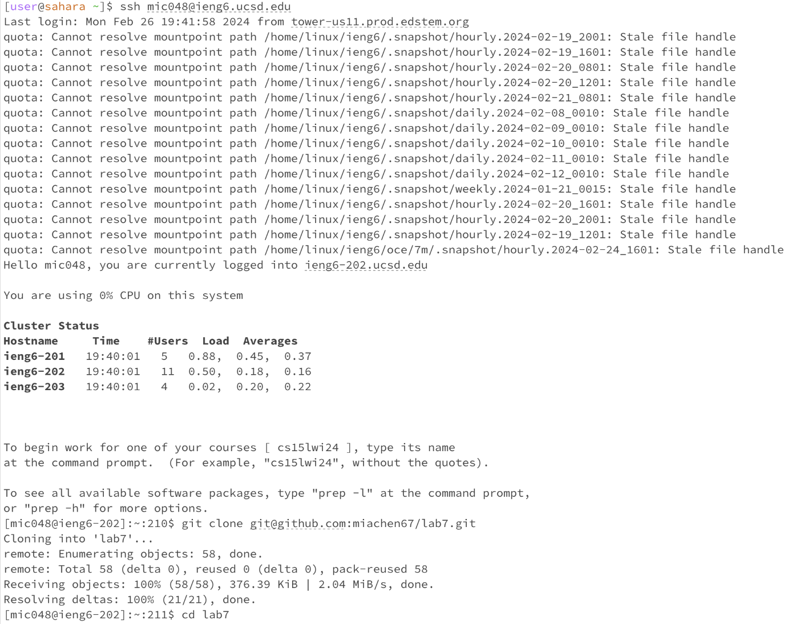
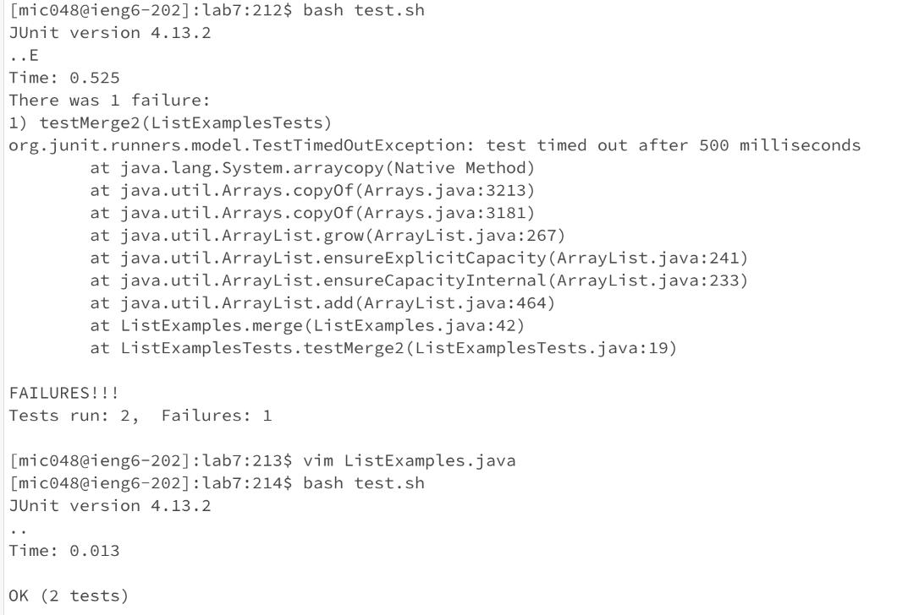
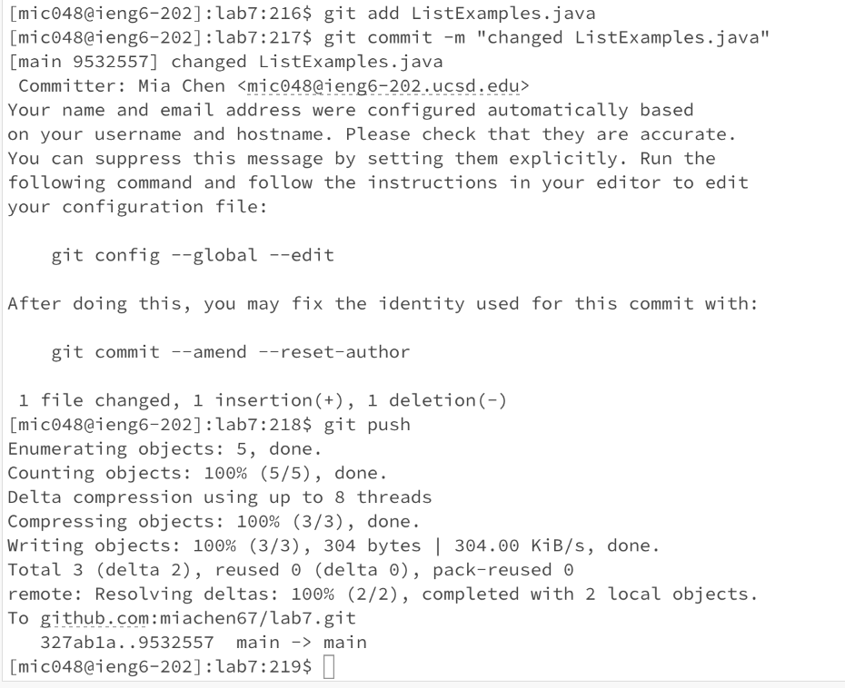

# Lab Report 4 <br/>
In this week's lab, we practiced using vim to make edits from the command line!

## Using vim to edit ListExamples.java from a forked repository

```
Keys Pressed for step 4 and 5: 
ssh<space>mic048@ieng6.ucsd.edu<ENTER> - to log into the remote server.
git<space>clone<space>git@github.com:miachen67/lab7.git<ENTER> to clone the repository
from my GitHub account
```

```
Keys Pressed for steps 6-8: 
cd<space>lab7<ENTER> - cd into lab 7.
bash<space>test.sh<ENTER> - to run the ListExamplesTests.java file.
vim<space>ListExamples.java<ENTER> - to use vim to change ListExamples.java.
G k k k k k k e r 2 :wq - 'G' took me to the last line of the file, 'k' to go up six lines, 
'e' to jump to the end of the first word "index1", 'r2' to replace the character 
1 with 2, and ':wq' to save and exit.
<up> <up> <ENTER> - the bash.sh command was 2 up so I used arrow for it.
```



```
Keys Pressed for step 9:
git<space>add<space>L<TAB> .java <ENTER> - using <TAB> autofilled ListExamples for me; this command 
added the changes in ListExamples.java to the staging area.
git<space>commit<space>-m<space>"changed ListExamples.java"<ENTER> - this command committed the 
changes to my local repository.
git<space>push<ENTER> - this command pushed the changes to the remote repository.

```
